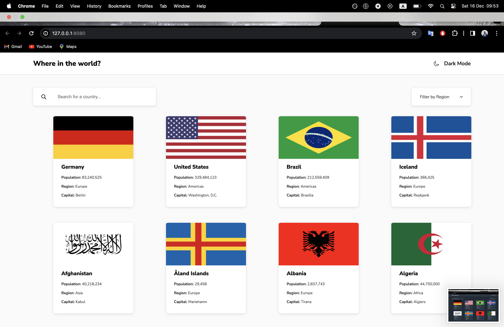
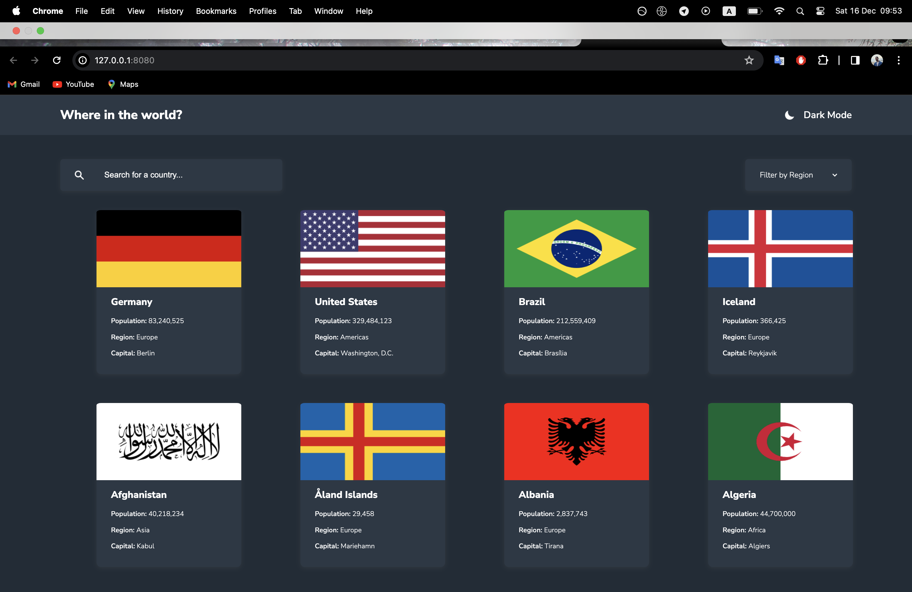
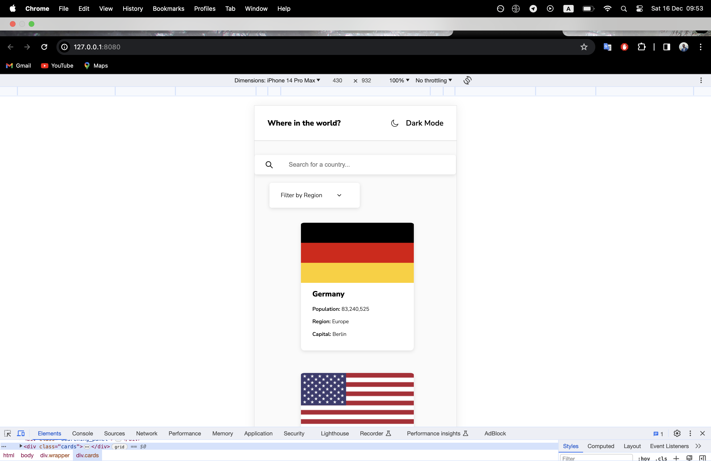

### The challenge

Users should be able to:

- See all countries from the API on the homepage
- Search for a country using an `input` field
- Filter countries by region
- Click on a country to see more detailed information on a separate page
- Click through to the border countries on the detail page
- Toggle the color scheme between light and dark mode

### Screenshot

### Links

- Live Site URL: [Netlify live site](https://maks-rest-countries.netlify.app/)

### Built with

- Semantic HTML5 markup
- CSS custom properties
- Flexbox
- CSS Grid
- Mobile-first workflow
- Vanilla Js

## Author

- LinkedIn - [Maksym Kostiuk](https://www.linkedin.com/in/maksym-kostiuk-261958297/)
